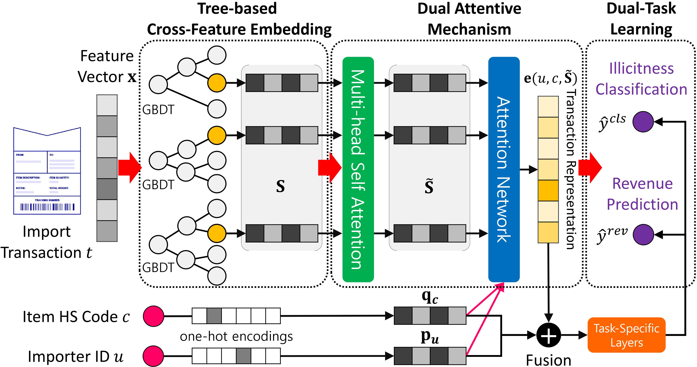
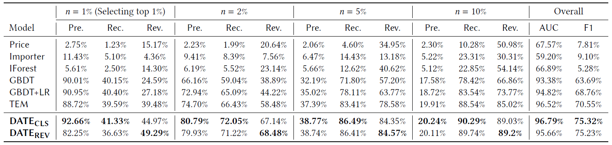

# DATE: Dual Attentive Tree-aware Embedding for Customs Fraud Detection
[](https://creativecommons.org/licenses/by-nc-sa/4.0/)

Implementation of our KDD paper [DATE: Dual Attentive Tree-aware Embedding for Customs Fraud Detection](kdd2020-date.pdf).

DATE is a model to classify and rank illegal trade flows that contribute the most to the overall customs revenue when caught.
* DATE combines a tree-based model for interpretability and transaction-level embeddings with dual attention mechanisms. 
* DATE learns simultaneously from illicitness and surtax of each transaction.
* DATE shows 92.7% precision on illegal cases and a recall of 49.3% on revenue after inspecting only 1% of all trade flows in Nigeria.


## Overview of the Transaction-level Import Data
An Import Declaration is a statement made by the importer (owner of the goods), or their agent (licensed customs broker), to provide information about the goods being imported. The Import Declaration collects details on the importer, how the goods are being transported, the tariff classification and customs value.


### Synthetic Data
For your understanding, we upload the synthetic import declarations in the `data/` directory.
Users are expected to preprocess their own import declarations into a similar format.

|sgd.id|sgd.date  |importer.id| tariff.code| ... |cif.value|total.taxes|illicit|revenue|
|:----:|:--------:|:---------:|:----------:|:---:|--------:|----------:|:-----:|------:|
| SGD1 | 13-01-02 | IMP826164 |8703241128  | ... |2809     | 647       | 0     | 0     |
| SGD2 | 13-01-02 | IMP837219 |8703232926  | ... |266140   | 3262      | 0     | 0     |
| SGD3 | 13-01-02 | IMP117406 |8517180000  | ... |302275   | 5612      | 0     | 0     | 
| SGD4 | 13-01-02 | IMP435108 |8703222900  | ... |4160     | 514       | 0     | 0     |
| SGD5 | 13-01-02 | IMP717900 |8545200000  | ... |239549   | 397       | 1     | 980   |


## Model Architecture
DATE consists of three stages. The first stage pre-trains a tree-based classifier to generate cross features of each transaction. The second stage is a dual attentive mechanism that learns both the interactions among cross features and the interactions among importers, HS codes, and cross features. The third stage is the dual-task learning by jointly optimizing illicitness classification and revenue prediction. The overall architecture is depicted in Figure 2.




## Requirements
* Ranger optimizer:
    * https://github.com/lessw2020/Ranger-Deep-Learning-Optimizer
* pytorch>=1.0.0
* torch_multi_head_attention
* scikit-learn>=0.21.0
* numpy>=1.16.4
* pandas>=0.25.3 


## How to Install  
1. Clone the repository
```
git clone https://github.com/Roytsai27/Dual-Attentive-Tree-aware-Embedding.git
```
2. Install requirements
```
pip install -r requirements.txt
```
3. Check [DATE_manual](DATE_manual.ipynb) to grasp how it works

## How to Train the Model
1. Run `preprocess_data.py` 
This script would run the preprocessing for raw data from customs and dump a preprocessed file.
2. Run `generate_loader.py`
This will train and evaluate XGB model and XGB+LR model.
Also, the scipt will dump a pickle file for embedding model input.
3. Run `train.py`
You can tune the hyper parameters by adding args after train.py.
e.g. python3 train.py --epoch 10 --l2 1e-6 etc.

__Important:__ With default settings, the model will run on synthetic data.

__Note:__ [DATE_manual](DATE_manual.ipynb) provides a step-by-step execution of DATE model and detailed explanation of each method.

Parameters for `train.py`
```
--epoch: number of epochs
--l2: l2 regularization 
--dim: dimension for hidden layers
--use_self: Use leaf-wise self-attention or not 
--alpha: The adaptive weight to balance the scale and importance for regression loss
--lr: learning rate
--head_num: number of heads for self-attention
--act: activation function (Relu or Mish)
--device: The device name for training, if train with cpu, please use:"cpu" 
--output: save the performance output in a csv file
```
Parameters for `preprocess_data.py` and `generate_loader.py`: [Check this document](parameters.md)


## Main Results
Below table illustrates the DATE model and its baseline results of the Nigerian import declarations.




## Other Experiments & Codes 
Code for auxiliary experiments are uploaded in the `experiments/` directory.
* [revcls](./experiments/kdd2020-exp-revcls/): Section 5.1, date_cls and date_rev results 
* [ablation-studies](./experiments/kdd2020-exp-ablation-studies/): Section 5.3, includes w/o attention network and w/o fusion. Modify `model/AttTreeEmbedding.py` with the provided code. w/o dual task learning and w/o multi-head self attention could be done by setting args in `train.py`
* [training-length](./experiments/kdd2020-exp-training-length/): Section 5.4, effects on training length
* [corrupted-data](./experiments/kdd2020-exp-corrupted-data/): Section 6, way to leverage existing data
* [hyperparameter-analysis](./experiments/kdd2020-exp-hyperparameter-analysis): Section 7.1-2, hyperparameter analysis
* [loss-weight](./experiments/kdd2020-exp-loss-weight): Section 7.3, date_cls and date_rev by controlling alpha
* [interpreting-results](./experiments/Interpreting-DATE-Results.ipynb): Section 5.6, interpreting DATE results by finding effective cross-features with high attention weight


## Citation
If you mention DATE for your publication, please cite the original paper:
```LaTeX
@inproceedings{kimtsai2020date,
  title={DATE: Dual Attentive Tree-aware Embedding for Customs Fraud Detection},
  author={Kim, Sundong and Tsai, Yu-Che and Singh, Karandeep and Choi, Yeonsoo and Ibok, Etim and Li, Cheng-Te and Cha, Meeyoung},
  booktitle={Proceedings of the 26th ACM SIGKDD International Conference on Knowledge Discovery and Data Mining},
  year={2020}
}
```
